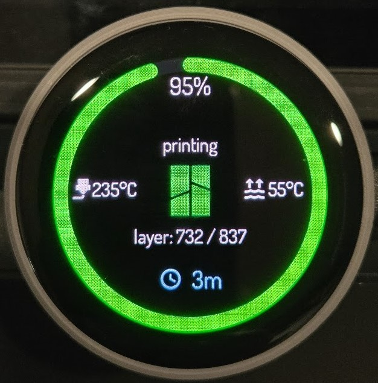
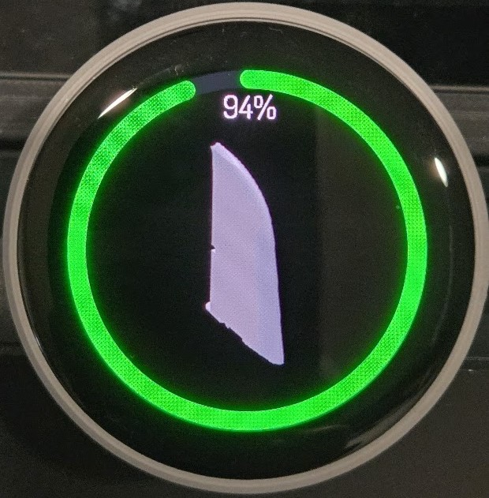

# PrintSphere-Display (ESPHome + LVGL, Round AMOLED)

A 🟢 ESP32-S3 display for Bambu Lab / Home Assistant print status:
- large progress ring
- two-page UI (LVGL) (status info + round preview image)
- colors/animations per stage/status
<p align="left">
  
</p>
<p align="right">
  
</p>
---

## Hardware

- **ESP32-S3 Round AMOLED, 466×466**, Quad‑SPI display  
  e.g., Waveshare Round AMOLED (CO5300 panel)  
  > In ESPHome configured as `display: platform: mipi_spi` with `bus_mode: quad`.
- **Touch**: FT63x6 (I²C @ `0x38`)

---

## Dependencies

- **ESPHome** `>= 2025.9.0`
- **LVGL** via the ESPHome `lvgl:` component
- **Home Assistant** with Bambu Lab entities (see below) and network access  
  (`substitutions.homeassistant_url` must be reachable)

---

## Configuration (excerpt)

```yaml
substitutions:
  homeassistant_url: https://<your-ha>:8443   # or http://<your-ha>:8123
  bambulab_printer: p1s_01p00a546874654       # printer ID/slug from Home Assistant
  bambulab_icon: images/bambuicon.png         # local icon for the UI page 1
```

> The full YAML includes `lvgl`, `display: mipi_spi`, `touchscreen: ft63x6`, status and image widgets, and the UI logic (colors/animations, status text, ring updates).

---

## Expected Home Assistant entities

**Sensors (required)**

- `sensor.<printer>_current_stage`
- `sensor.<printer>_print_status`
- `sensor.<printer>_print_progress`

**Sensors (optional, extra info)**

- `sensor.<printer>_nozzle_temperature`
- `sensor.<printer>_bed_temperature`
- `sensor.<printer>_remaining_time`
- `sensor.<printer>_current_layer`
- `sensor.<printer>_total_layer_count`

**Binary sensors (optional, errors)**
- `binary_sensor.<printer>_hms_errors`
- `binary_sensor.<printer>_druckfehler`

**Image entity (for Page 2, round preview)**
- `image.<printer>_titelbild` (its `entity_picture` is used)

> Without `image.<printer>_titelbild`, Page 2 shows “Preview disabled”.

---

## UI & Rendering

- **Pages**:  
  - **Page 1**: status, layer, remaining time, temperatures  
  - **Page 2**: round image preview
- **Overlay**: `arc_main` (ring) and **percentage** are on `lv_layer_top()` → they stay **static** while scrolling.
- **Colors/animations** (stage/status-based):  
  - Preheat/Prepare: pulsing orange  
  - Clean nozzle: pulsing light/dark  
  - Bed level: pulsing violet  
  - Error: pulsing red  
  - Idle (true): solid gray  
  - Printing: blended progress color toward the target  
  - Filament **loading/unloading**: yellow progress animation (takes priority over errors)

---

## Status logic (short)

- **Filament (un)loading** → show “loading”/“unloading”, ring yellow animated.  
- **Error** → if `print_status=failed` **or** `hms_errors` **or** `druckfehler` → show “failed”, ring pulsing red.
- **Done (strict)** → show “done” **only if all are true**:
  - `print_status ∈ {finish, finished}`
  - `current_stage = idle`
  - `print_progress = 100`
- **Idle/Offline (not done)**:
  - if `print_status=prepare` → “preparing”
  - if `progress` in (1..99) **or** job is active → “printing” look
  - else → “idle” (gray)

---

## Setup notes

1. Flash the ESPHome project with the YAML (ESP32-S3, PSRAM enabled).
2. Set `homeassistant_url` correctly (including port/SSL).
3. Ensure the entities above exist in Home Assistant — especially `sensor.<printer>_*` and `image.<printer>_titelbild`.
